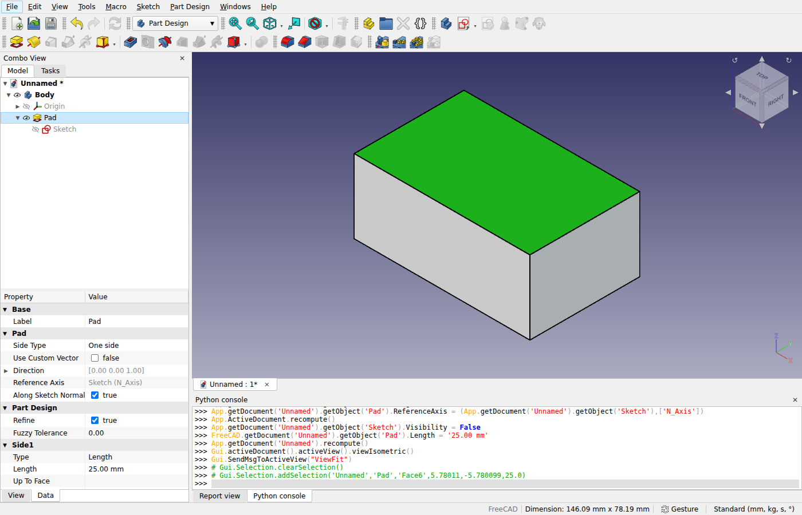

# fab_cad

FreeCAD in the browser: a web frontend that aims to be a 1:1 web version of FreeCAD's desktop UI,
driving FreeCAD's application core through the **FreeCAD API** — the request/response protocol in
the fabPlane FreeCAD fork (`src/Api/PROTOCOL.md`). It is the FreeCAD sibling of
[fab_pcb](https://github.com/fabPlane/fab_pcb), the KiCad web UI, and follows its conventions.

## Three backends, one protocol

| Backend         | How the page reaches FreeCAD                                                                                                                                                 | Transport            |
| --------------- | ---------------------------------------------------------------------------------------------------------------------------------------------------------------------------- | -------------------- |
| **Native**      | `FreeCADApiServer --listen ws://…` (or `FreeCADApi.startServer()` inside a running FreeCAD), dialed directly or through `@fab-cad/bridge`, which spawns one per session      | `WebSocketTransport` |
| **WebAssembly** | the same API core compiled to `freecad_api.wasm`, loaded in the page or a Web Worker by `@fab-cad/freecad-wasm`                                                              | `WasmTransport`      |
| **Mock**        | `@fab-cad/mock-server`: an in-memory fake with Part primitives, real tessellations, undo/redo and events — what the UI and the tests run against until the real server ships | either               |

Tools and tests can also run the native server as a child process over stdio (`StdioTransport`).

## Packages

| Package                 | What                                                                                                         |
| ----------------------- | ------------------------------------------------------------------------------------------------------------ |
| `@fab-cad/protocol`     | Command/event types, tagged values, JSON/CBOR envelopes, tessellation views. `FREECAD_COMMIT` pins the fork. |
| `@fab-cad/client`       | Transports (WebSocket, stdio, wasm), `FreeCADClient` (typed commands and events), `DocumentStore`.           |
| `@fab-cad/mock-server`  | The in-memory FreeCAD API: a wasm-shaped dispatcher, a WebSocket server, a CLI.                              |
| `@fab-cad/freecad-wasm` | Loader for the `fcapi_*` WebAssembly module, MEMFS helpers, Web Worker host.                                 |
| `@fab-cad/bridge`       | Bun server: `FreeCADApiServer` per session, WebSocket proxy, file API, static hosting.                       |
| `apps/web`              | The web UI: FreeCAD's desktop frontend in the browser (see [docs/02-web-ui.md](docs/02-web-ui.md)).          |
| `tooling/ci`            | Per-package test runner.                                                                                     |
| `tooling/icons`         | Copies FreeCAD's icons and command texts (menu text, tooltip, shortcut, pixmap) out of the fork.             |
| `e2e`                   | Playwright: a smoke suite against the in-page mock, a suite (and the screenshots) against a real server.     |



## Quick start

```sh
bun install && bun run ci                         # format, typecheck, unit tests
bun run dev                                       # the web UI on http://127.0.0.1:5180 (?mock=1 for the in-page mock)
FreeCADApiServer --listen ws://127.0.0.1:8765/    # then open http://127.0.0.1:5180/?ws=ws://127.0.0.1:8765/
bun packages/mock-server/src/main.ts              # mock FreeCAD API on ws://127.0.0.1:8765/ (demo document)
```

```ts
import { FreeCADClient, WebSocketTransport } from "@fab-cad/client";

const client = await FreeCADClient.connect(await WebSocketTransport.connect("ws://127.0.0.1:8765/"));
await client.setProperties("Demo", "Box", { Length: "25 mm" });
await client.recompute("Demo");
const meshes = await client.tessellate("Demo"); // Float32Array / Uint32Array per object
```

With the bridge in front (one FreeCAD per session, here the mock standing in):

```sh
FREECAD_API_SERVER="bun packages/mock-server/src/main.ts" bun packages/bridge/src/main.ts
curl -X POST localhost:4030/sessions                # -> {session, wsUrl: "/ws?session=…"}
```

See [docs/01-architecture.md](docs/01-architecture.md) for how it fits together and
[AGENTS.md](AGENTS.md) for working rules.
